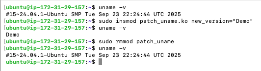

# uname

A custom linux kernel module that edits ```uname -v``` to display a custom version string.

> [!NOTE] 
> Tested on Ec2 tg4.small instances running ubuntu (6.14.0-1015-aws)

## Example



## Installation
Install dependencies:
```bash
sudo apt update
sudo apt install -y build-essential linux-headers-$(uname -r)
```

Build the module:
```bash
make
```

## Usage
1. Load the module:
```bash
sudo insmod patch_uname.ko new_version="CustomVertionName"
```

2. Check the new version string:
```bash
uname -v
```

3. Unload the module:
> Need to do this every time you want to change the version string

```bash
sudo rmmod patch_uname
```
